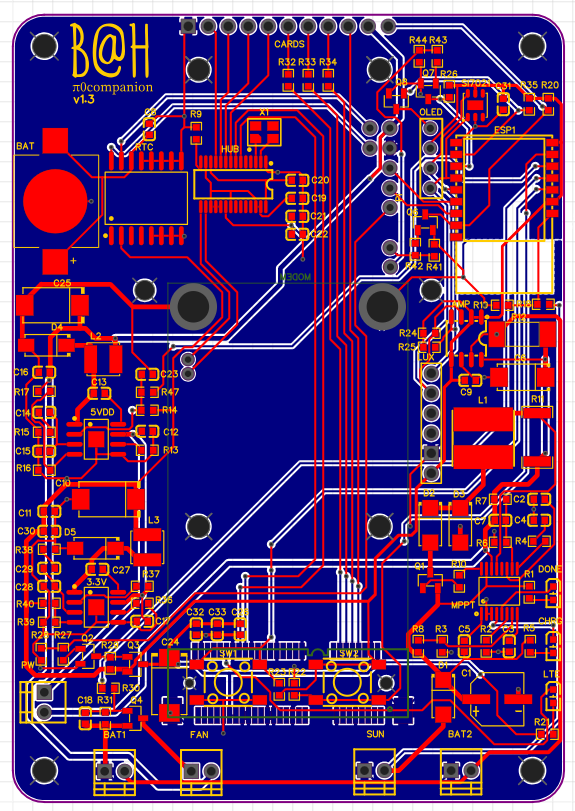
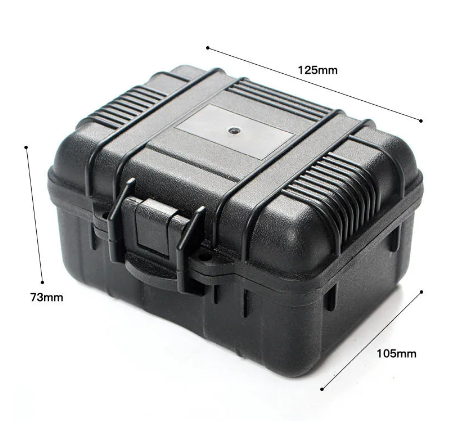
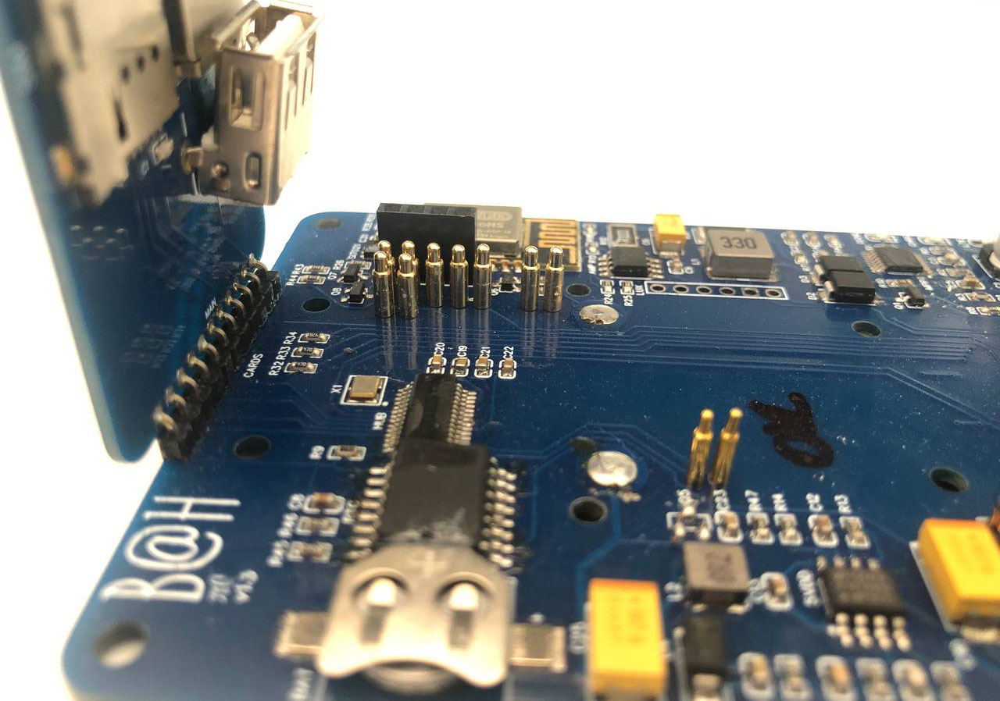
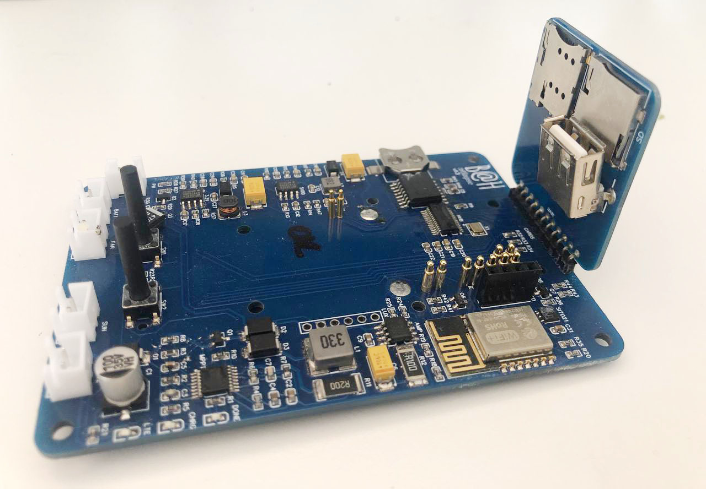

<!DOCTYPE html>
<html lang="en">
<head>
    <meta charset="UTF-8">
    <meta name="viewport" content="width=device-width, initial-scale=1.0">
</head>
<body>

<h1>π0companion</h1>

We all love our Raspberry Pi projects, and most time using a good PSU is enough to have reliable system. 
But what if you want to take your project mobile of off-grid, how to manage the power requirements and beyond that, be able to trust in the continuous operation of your device. 
Thinking on that this companion circuit was created. It can be used on usual size Raspberry Pi boards, but considering power consumption for off-grid project this version focus on Pi Zero, any versions. 
It adds the following features to your Pi:

<ul>
    <li><strong>Modem Mini Pcie slot:</strong> 4G modem is a must for any mobile project, and it can include GPS. Based on EG25G/EC25 from Quectel.</li>
    <li><strong>Micro-controller IO/s and Power MGMT:</strong> To add a second layer of IOs and also working as a Watch Dog to the system, a ESP-M2 is used in parallel with the Pi.</li>
    <li><strong>MPPT Charger:</strong> For when a constant power supply is not available, the circuit includes a simple MPPT charger that can be used with Solar Panel or Wind generator.</li>
    <li><strong>HMI:</strong> Direct access to the micro-controller using push buttons and Oled display.</li>
    <li><strong>Environment sensors:</strong> Temperature, humidity, solar/input voltage, battery power monitoring, I2C slot expansion.</li>
    <li><strong>Extra Storage:</strong> Depending on the storage requirement, having extra space to store media and avoid over-using the Pi's main SD is recommended, so an SD card reader is available.</li>
    <li><strong>USB Hub:</strong> Since Pi Zero has a single USB port a local hub is added, to be shared with Pcie modem, SD Card and an extra USB-A Port.</li>
    <li><strong>RTC:</strong> As internet connection is not always available, and even when is it takes some time after boot to adjust the system clock, a local RTC clock was added.</li>
</ul>

The provided code is for the local micro-controller, and the companion code for the Pi for burning ESP and also communicate with the base board.

<h2>Getting Started</h2>

To get started with this project, follow these steps:

<ol>
    <li><strong>Hardware:</strong> You can use development modules for each sensor and the micro-controller, or assemble the suggested PCB.</li>
    <li><strong>Software:</strong> 
    <ul><strong>Compilation:</strong>  This code is for Arduino IDE and requires the following extra libraries to be installed:</li>
    <ul>
        <li><strong>ESP8266WiFi</strong> | You first need to add ESP8266 support on Arduino IDE | https://arduino-esp8266.readthedocs.io/en/latest/installing.html</li>
        <li><strong>Adafruit INA219</strong> | INA219 DC current and voltage sensor | https://github.com/adafruit/Adafruit_INA219</li>
        <li><strong>Arduino Json</strong> | To supports JSON serialization and deserialization | https://arduinojson.org/?utm_source=meta&utm_medium=library.properties</li>
        <li><strong>SparkFun Si7021</strong> | Si7021 Temperature and Humidity sensor | https://github.com/sparkfun/SparkFun_Si7021_Arduino_Library</li>
        <li><strong>Adafruit SSD1306</strong> |  Monochrome OLEDs based on SSD1306 drivers | https://github.com/adafruit/Adafruit_SSD1306</li>
        <li><strong>Adafruit GFX</strong> | Core graphics library for Adafruit displays | https://github.com/adafruit/Adafruit-GFX-Library</li>
        <li><strong>LittleFS</strong> | A little fail-safe filesystem designed for micro-controllers. | https://github.com/littlefs-project/littlefs</li>
    </ul></ul>
    <ul>
    <strong>Deploying:</strong> 
    <ul><li>To burn the code in the circuit is straightforward if you are using a commercial ESP8266/ESP8285 module.</li>
    <li> For the suggested circuit, after compiling copy the .bin file to the Pi and use the esp_burn.sh to upload the code.
    </ul></li></ul>
</ol>

<h2>Usage</h2>

Taking your Pi on the road or just outside adds some other possibilities from the already vast options of use, such as:

<ul>
    <li><strong>Outdoor camera:</strong> Use for security, wildlife or timelapse camera is one obvious application with the Pi Camera modules.</li>
    <li><strong>Mobile Hotspot:</strong> We have a Pi with 4G module, you can create a hotspot very easily.</li>
    <li><strong>IoT Gateway:</strong> You can have multiple remote sensors using WiFi from the Pi to reach the Internet.</li>
    And many other projects.
</ul>

<h2>Observations</h2>

<ul>
    <li>If a commercial modules is used it can be either ESP8266 or ESP8285. In case of the suggested PCB uses ESP8285. In any case, select the correct hardware when compiling.</li>
    <li>PCB was design to fit in a 125x105x70mm plastic case, that are widely available online. You can also fit the batteries and any other module that you will need to use. 
    A 3D design [pcb_support.stl] is provided to mount the board inside the suggested case, it can be glued or use screws through the bottom of the case.</li>
    
    <li>To avoid soldering the required connections to the Pi, pogo testing pins can be used to reach GPIO and USB.</li>
    
    <li>To facilitate access a few components were move to a second board, like SD slot, SIM card slot, ESP reset button and USB-A port. This board should be assembled perpendicular to the main PCB.</li>
    
    <li>Battery should be a dual cell Li-ion for example 18650, to operate in 8.4V. Two connections for battery are available in parallel to increase capacity. Circuit can also be altered to operate in 12V, just requiring to adjust the MPPT charger output voltage.</li>
    <li>For charging in case of indoor use, any PSU from 18V to 28V with 1A can be used. Charger is configured to provide maximum 1A, but it could be changed to up 5A with some components adjustments and pcb redesign.</li>
</ul>

<h2>Future Work</h2>
<ul>
    <li><strong>Connectivity:</strong> Currently the code will disable the WiFi radio from ESP8285 to reduce power consumption, but a local wireless web interface could be added.</li>
    <li><strong>Micro-controller upgrade:</strong> Plans to change to ESP32 are on the way, allowing more IOs and also Bluetooth connectivity.</li>
    <li><strong>EOL parts:</strong> Some of the components used are reaching their End-Of-Life, but they are still widely available. In any case, newer recommended substitutes should be used in future versions</li>
</ul>

<h2>Contributing</h2>

If you want to contribute to this project, please follow these guidelines:

<ol>
    <li>Fork the repository.</li>
    <li>Create a new branch for your feature or bug fix.</li>
    <li>Make your changes and test them thoroughly.</li>
    <li>Create a pull request to submit your changes.</li>
</ol>

<h2>License</h2>

This project is licensed under the <a href="https://www.gnu.org/licenses/gpl-3.0.html">GNU General Public License v3.0 (GPL-3.0)</a>.

<!--
<h2>Acknowledgments</h2>

<ul>
    <li>Special thanks to <a href="CONTRIBUTORS.md">contributors</a> who have helped with this project.</li>
    <li>Icons made by <a href="https://www.example.com/">Author</a> from <a href="https://www.flaticon.com/">www.flaticon.com</a>.</li>
</ul>
-->
<h2>Contact</h2>

For questions or support, please contact us at <a href="mailto:argusr@me.com">argusr@me.com</a>.

</body>
</html>
